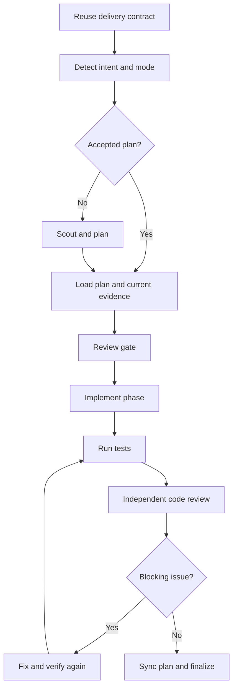

# Implement the Plan

`kevinle128-skills:implement` turns an accepted plan or clear implementation contract into verified code.

It owns implementation sequencing, approval gates, testing, review, progress synchronization, and final Git handoff.

## Start from a Plan

```text
/kevinle128-skills:implement /absolute/path/to/plan-directory/plan.md
```

The implementation workflow reads the plan files, respects phase dependencies and file ownership, and keeps their completion state synchronized.

You can also provide a natural-language task.

```text
/kevinle128-skills:implement "Add a health-check endpoint with integration coverage" --fast
```

When no accepted plan exists, the workflow still scouts and creates a plan before writing implementation code.

## Choose an Execution Mode

| Flag | Use it when | Approval behavior |
| --- | --- | --- |
| `--interactive` | You want explicit review between major steps. | Stops at research, plan, implementation, test, and review gates. |
| `--fast` | Scope is clear and research would add little value. | Skips research but keeps planning and human review gates. |
| `--parallel` | The plan defines independent phases with exclusive file ownership. | Runs eligible work concurrently and stops at normal review gates. |
| `--auto` | You explicitly want continuous autonomous execution. | Skips routine human gates but keeps tests, code review, and blockers. |
| `--no-test` | Tests cannot be run and you accept the risk. | Skips the test step but keeps review and reports the unverified risk. |

Interactive mode is the default.

Only `--auto` runs continuously without routine approval stops.

## Add Composable Behavior

- `--tdd` writes regression tests before the implementation in each phase and reruns them after the change.
- `--advice` adds advisory supervision after phases, at blockers, and before high-stakes decisions.
- `--yagni` explicitly permits removal of scope that is not required for the accepted outcome.
- `--skip-journal` skips the optional journal step.

```text
/kevinle128-skills:implement /absolute/path/to/plan.md --parallel --tdd
```

## What the Workflow Does



Before modifying each phase, the workflow reads project instructions, scouts adjacent patterns, searches for existing helpers, verifies public contracts, and cross-checks the phase inventory.

After implementation, it runs the relevant test, lint, type, and build gates for the affected contracts.

An independent reviewer checks acceptance criteria, regressions, public contracts, local patterns, and repository-wide quality failures.

## Parallel Execution

Use parallel mode only when the plan assigns exclusive files and declares dependencies.

```text
/kevinle128-skills:implement /absolute/path/to/plan.md --parallel
```

Independent phases may run concurrently.

Integration phases wait until their producers complete.

Do not use parallel mode to make multiple agents edit the same files or shared migration sequence.

## Tests-First Execution

```text
/kevinle128-skills:implement /absolute/path/to/plan.md --tdd
```

Each phase follows this order:

1. Add tests that protect current behavior.
2. Implement or refactor the code.
3. Add coverage for the new behavior.
4. Run regression, compile, type, and integration gates.

The strongest final proof is an end-to-end flow through the real user or system trigger.

Unit tests support that proof but do not replace it.

## When the Workflow Stops

The workflow stops or asks for a decision when it finds an unresolved regression, public-contract conflict, unsafe irreversible action, repeated failed repair, or missing product decision.

It does not hide failing tests or silently weaken assertions.

## Completion

Completion requires the accepted behavior, passing verification, independent review, full-plan status synchronization, a docs-impact decision, and the configured Git approval flow.

The final report names what changed, what was verified, and any remaining risk.

Next: [Debug and fix defects](./04-debug-and-fix.md).
