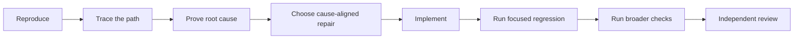

# Debug and Fix Defects

A symptom is not a root cause.

Kevin Kit separates diagnosis from repair so the implementation fixes the shared failure point instead of patching one visible caller.

## Use `kevinle128-skills:debug` for Diagnosis

Use [`kevinle128-skills:debug`](../../skills/debug/SKILL.md) when you need to explain a failure before deciding whether to change code.

```text
/kevinle128-skills:debug The worker applies stale model settings after an idle wake.
```

The diagnostic result should identify the exact symptom, reproduction, expected and actual behavior, execution path, root cause, and evidence that rules out competing hypotheses.

Stop after diagnosis when the user requested investigation only.

## Use `kevinle128-skills:fix` for Repair

Use [`kevinle128-skills:fix`](../../skills/fix/SKILL.md) for a concrete bug, failed test, type error, lint failure, or CI failure.

```text
/kevinle128-skills:fix The session worker uses the previous model after settings are updated --review
```

`kevinle128-skills:fix` begins with a bounded repair contract, scouts the affected path, reproduces the problem, proves the cause, implements the repair, and reruns verification.

## Fix Modes

| Flag | Use it when |
| --- | --- |
| `--auto` | You want autonomous diagnosis and repair with required gates still enforced. |
| `--review` | You want human review at material decisions. |
| `--quick` | The problem is a trivial lint, type, or similarly narrow failure. |
| `--parallel` | Several independent issues can be diagnosed or repaired by separate owners. |
| `--advice` | The failure is high risk, repeatedly stuck, or requires an architectural decision. |
| `--skip-journal` | The repair does not need an automatic journal entry. |

Autonomous mode is the default.

Quick mode shortens the loop but does not permit guessing the cause.

## The Repair Loop



For user-facing failures, reproduce through the same public surface the user uses whenever possible.

For event-driven work, trigger the real event boundary.

For third-party calls, mock the third party at its boundary while keeping internal service calls real.

## Supporting Skills

- [`kevinle128-skills:scout`](../../skills/scout/SKILL.md) finds owners, callers, tests, and recent changes.
- [`kevinle128-skills:sequential-thinking`](../../skills/sequential-thinking/SKILL.md) manages multi-step hypotheses that need revision.
- [`kevinle128-skills:problem-solving`](../../skills/problem-solving/SKILL.md) reframes the problem after repeated dead ends.
- [`kevinle128-skills:agent-browser`](../../skills/agent-browser/SKILL.md) reproduces clean browser and Electron flows.
- [`kevinle128-skills:chrome-profile`](../../skills/chrome-profile/SKILL.md) reproduces behavior that depends on the user's real Chrome login or cookies.
- [`kevinle128-skills:test`](../../skills/test/SKILL.md) runs the focused and broad validation suites.
- [`kevinle128-skills:code-review`](../../skills/code-review/SKILL.md) checks the final repair for regressions and contract breaks.

## Failed Attempts

After three failed repair attempts, stop repeating local variations.

Question the architecture, restate the evidence, and use `kevinle128-skills:problem-solving` or advisory supervision to select a new direction.

## Pitfall: Guarding the Symptom

A null check at the crash site may hide the failure while leaving every sibling caller broken.

Trace the callers and place the repair at the shared owner when the evidence supports it.

Next: [Test, review, and ship](./05-test-review-and-ship.md).
