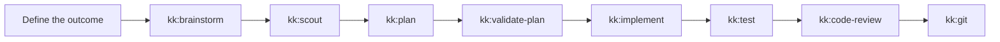

# The KevinKit Guide

KevinKit is a collection of reusable AI-agent skills for planning, implementation, debugging, verification, and delivery.

The skills work best when you state the outcome, constraints, and evidence of completion, then let the owning workflow route the supporting skills.

This guide follows a real delivery journey instead of documenting each skill in isolation.

## Install KevinKit

Install the `kk` binary from [GitHub Releases](https://github.com/kevinle128/skills/releases), then install its embedded skills:

```bash
kk install
```

The default target installs each skill into `~/.agents/skills` for Codex and Devin and `~/.claude/skills` for Claude Code.

Run `kk status` to inspect the installation and `kk update --yes` to install a checksum-verified release.

See the [root README](../../README.md#installation) for platform archives, target selection, dry-run behavior, backups, and uninstall instructions.

## What You Will Learn

1. [Choose a workflow](./01-choose-a-workflow.md) for a feature, bug, GitHub issue, new project, or release.
2. [Plan the work](./02-plan-the-work.md) with evidence, explicit phases, validation, and adversarial review.
3. [Implement the plan](./03-implement-the-plan.md) after validation, with approval gates, tests, review, and progress tracking.
4. [Debug and fix defects](./04-debug-and-fix.md) by reproducing the failure and proving the root cause first.
5. [Test, review, and ship](./05-test-review-and-ship.md) with real behavior evidence and a controlled Git workflow.
6. [Use specialized workflows](./06-specialized-workflows.md) for browsers, frontend work, media, diagrams, docs, and context preparation.
7. [Find any skill](./07-skill-catalog.md) in the complete KevinKit catalog.
8. [Copy practical recipes](./08-recipes-and-pitfalls.md) and avoid common workflow mistakes.

Read the pages in order for your first task.

After that, each page can be used independently.

## The Main Workflow



You do not need to invoke every skill manually.

The main workflow skills call supporting skills when their contracts require them.

## If You Remember One Thing

Choose the entry skill from the kind of work, then describe what done means.

```text
/kk:plan Add session-based authentication.
Done means the public login API works through an end-to-end test, invalid credentials are rejected, and existing sessions still pass regression tests.
```

The outcome and evidence are more important than a hand-written sequence of internal steps.

## Invocation Notation

Examples use `/kk:<skill-name>` notation.

If your runtime uses a skill picker or `$skill-name` syntax, select the same `kk:<skill-name>` skill by name.

The `ak` executable is still the AgentKit CLI.

Commands such as `ak plan` and `ak config` are CLI operations, not skill invocations, and keep the `ak` name.

Next: [Choose a workflow](./01-choose-a-workflow.md).
